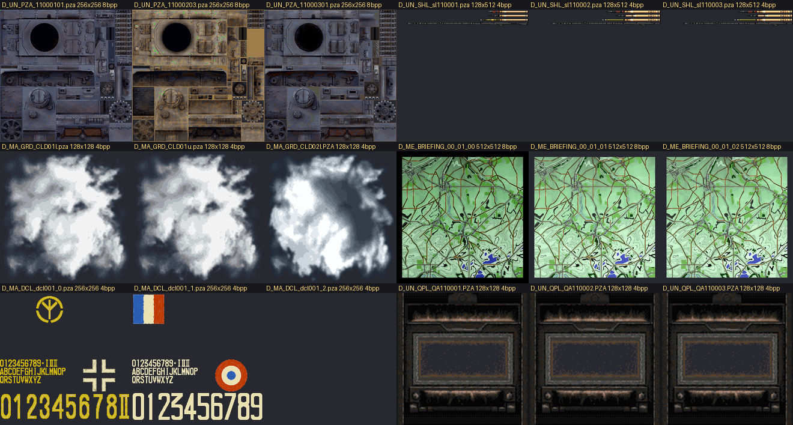

# Panzer Front Ausf.B — file formats and tools

Reverse-engineered file formats, extraction tools and emulator research for
**Panzer Front Ausf.B** (PlayStation 2, 2004). PAL release SLES-52984, CRC `F2694B94`.

**This repository contains no usable game data.** The tools read your own disc image.
Nothing extracted from the game is redistributable, and the `.gitignore` keeps it out —
the only exception is the small illustrative thumbnails below, included to document what
the texture decoder produces.



*Decoded with `tools/pza2png.py`: vehicle skins, cloud layers, 1940 briefing maps of the
Belgian ground around Jandrenouille and Merdorp, national markings and turret numerals,
and crew-position interior panels. 1404 of 1405 files decode cleanly.*

## Formats

| | |
|---|---|
| [pak.md](docs/pak.md) | the disc archive — **solved** |
| [pza.md](docs/pza.md) | indexed textures, 1409 files — **solved** |
| [pze.md](docs/pze.md) | message tables, all in-game text — **solved** |
| [st.md](docs/st.md) | per-vehicle statistics — partial |
| [formats-status.md](docs/formats-status.md) | everything else, and what is still open |

The geometry format is the main thing still unsolved.

## Tools

Python 3, needs `Pillow` for texture conversion.

```bash
# inventory both archives, straight from the ISO
python tools/paklist.py

# extract by wildcard
python tools/pakx.py "*.PZA" out/
python tools/pakx.py "*NE*MAP*EVT01.*" out/

# decode textures to PNG
python tools/pza2png.py out/*.pza png/
```

Edit `ISO_PATH` at the top of `paklist.py` / `pakx.py` to point at your disc image.

## Widescreen patch

`SLES-52984_F2694B94.pnach` is a Hor+ 16:9 patch for the PAL release — the horizontal
field of view widens by exactly 4/3, the vertical is untouched and the 2-D HUD is
pixel-identical. Submitted to
[PCSX2/pcsx2_patches](https://github.com/PCSX2/pcsx2_patches/pull/790).

Drop it in PCSX2's `cheats\` folder and set the aspect ratio to 16:9.

[research/pcsx2-widescreen-research.md](research/pcsx2-widescreen-research.md) is the full
log of how it was found, including the dead ends — a frame-pacing constant that turned out
not to be the framerate limiter, and a renderer theory that was disproved by testing it.

## Credits

The PAK container was first documented by **derplayer**
([QuickBMS script, 2022](https://gist.github.com/derplayer/d825a75a99e9844d9e643596c006099c)).
This repo reimplements it and adds the texture, message and statistics formats.

Reverse engineering is AI-assisted, verified by controlled savestate A/B testing against
the running game.

## Legal

The game, its assets and the Sony SDK are copyrighted. Reverse engineering for
interoperability and personal study is generally defensible; redistributing extracted
assets, converted data or game code is not. Use these tools on a copy you own.
