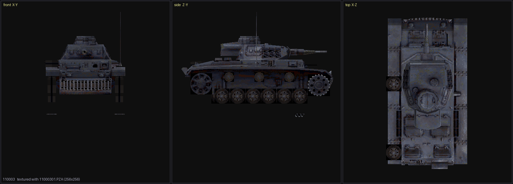

# PZ — model format  **SOLVED**

129 files, 37 MB, under `\D\MA\Obj` (map props), `\D\UN\PZ` (vehicles) and
`\D\OT\AS\INF\MDL` (infantry). Models load, assemble and texture correctly.



## Layout

```
+0                u32       size (== file size)
+4                u32       n   node count
+8                n x u32   parent index, 0xFFFFFFFF = root
+8  + 4n          n x u32   node id (a part number, e.g. 100011 — not an index)
+8  + 8n          n x 64    node matrix, 16 float32, row-major
+8  + 72n         n x u32   payload offset, relative to `mesh`
+8  + 76n         n x 24    AABB table, 6 float32: maxX,minX,maxY,minY,maxZ,minZ
+8  + 100n        32        zero padding
mesh = +8+100n+32           mesh data
```

Node *i* owns `[mesh+offs[i], mesh+offs[i+1])`; the last runs to EOF. **The offset table is
the authoritative partition** — do not scan for delimiters.

### AABB table

`max` is stored **before** `min`. An empty node is an *inverted* box, `(-100000, +100000)` on
all three axes, so `max < min` means "no geometry".

This is also a free self-check on any parser, and it is a strong one: the table is
independent of the mesh data, and a correct decode must reproduce it exactly.

### Vertex streams

A sub-mesh is four equal streams of 16-byte rows, in order **P → N → C → T**:

| stream | row | |
|---|---|---|
| P position | `(x, y, z, 1.0)` | |
| N normal | `(nx, ny, nz, 1.0)` | unit length; `(0,0,0)` on degenerate vertices |
| C colour | `(r, g, b, 0.0)` | 0..255 |
| T texcoord | `(u, v, 1.0, 0.0)` | u,v may exceed 1 |

P and N carry `w == 1.0`, C and T carry `w == 0.0`, so **the leading run of `w == 1.0` rows
is exactly 2V**. Read `4V` rows, skip zero padding, repeat.

### Connectivity

**Flat triangle list.** `V = 3 x triangles`, consecutive non-overlapping triples. No index
buffer. Positions repeat (~41% unique) because the soup splits vertices at hard edges.

### Placement and orientation

```
world = v @ M_node @ M_parent @ ... @ M_root        (child first)
display: (x, y, z) -> (x, -y, -z)                   (a view convention)
```

Row-vector convention — **translation is row 3**, not column 3. The 3x3 part is identity on
most nodes, an axis mirror on a few. The translations are the placement and are mandatory.

### The redundant shell

Every vehicle holds **two root subtrees**, and the first is a simplified shell the game does
not draw — large flat panels with a single texel, about 42% of surface area on `110003`.
Drawn, it blanks the hull sides and engine deck.

**Rule: drop any root subtree in which every sub-mesh is flat** (all vertices share one UV).
Fires on 46 / 129 models, always exactly one subtree. The 100% threshold matters — `330059`
root 0 is 57% flat and must be kept.

## Verification

| check | result |
|---|---|
| node AABB == decoded vertex bbox | **5671 / 5671 (100%)** across all 129 files |
| sub-mesh vertex count divisible by 3 | **12311 / 12311 (100%)** (chance 33%) |
| triangle quality by phase | phase 0 **0.1773**, phase 1 0.1031, phase 2 0.0886 — a strip would score equally at each |

The first two were reproduced independently in this repo from the spec below.

## Superseded — do not resurrect

Earlier revisions of this file claimed, and these are **wrong**:

* ~~"sub-meshes are delimited by three all-zero rows"~~ — an all-black colour stream is a
  legitimate long zero run. `OBJ011` node 2 is `P(30) N(30) C(30, all zero) T(30)`. The 99.5%
  measurement behind this was real and the rule was still wrong; it failed exactly where it
  mattered.
* ~~"`phase = 8*(n%2)` is part of the format"~~ — it is a *symptom* of the 24n-byte AABB
  table, which lands 8 bytes past a 16-byte boundary when n is odd. The rule held at 100%
  without being the explanation.
* ~~"±100000 sentinels contaminate the position stream"~~ — they are the AABB table's
  empty-box value, sitting in front of the mesh.
* ~~"node transforms are essentially identity"~~ — identity in their 3x3 part only; the
  translations are the placement.

What did hold up: there is **no index list** (positions repeat ~41% unique), the matrices are
row-vector, and composition is child-first.

## Credit

The format was solved in a parallel DeepSeek session commissioned by the repo owner; the full
working notes are in that workstream's `PZ_HANDOVER.md`. The spec above was re-derived and
re-verified against the files independently before being published here.
