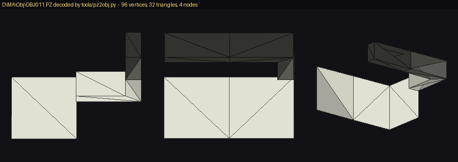

# PZ — model / scene graph

129 files, 37 MB, under `\D\MA\Obj` (map objects), `\D\UN\PZ` (vehicles) and
`\D\OT\AS\INF\MDL` (infantry). **Container solved, mesh payload only partly decoded.**

## Container — verified on all 129 files

```
0x00            u32       file size (equals the actual file length in all 129)
0x04            u32       node count N
0x08            N x u32   parent index, 0xFFFFFFFF = root
0x08 + 4N       N x u32   node ID (100000, 100001, 10090, 60010, 1101 ...)
0x08 + 8N       N x 64    4x4 float matrix, the node's local transform
0x08 + 72N      N x u32   payload offset, relative to the end of this table
0x08 + 76N      ...       per-node payloads, in order
```

Checked across the whole set: `word0 == filesize`, offsets ascending and starting at 0,
and the last payload ending exactly at EOF — **129 / 129 consistent**.

The parent array is a valid hierarchy: every entry is either `-1` or a node index below
`N`. A tank is typically 150-200 nodes, a map object 4-120. The matrices are frequently
identity with Z negated, i.e. a handedness flip.

Node IDs are semantic, not sequential — `100000` for the root, then codes like `100011`,
`10090`, `60010`, `1101`, `30000`. They group plausibly by part, but **no ID has been tied
to a named component**.

## Payloads — solved

There is **no per-node header**. 243 payloads of identical length were diffed byte by byte
and share **zero** constant bytes, so nothing sits at a fixed position. No VIF or GIF tags
are present either, so this is not stored DMA packet data.

### Vertex rows — 16 bytes, four types

| type | shape | notes |
|---|---|---|
| `T` texcoord | `(u, v, 1.0, 0.0)` | u,v in 0..1 |
| `P` position | `(x, y, z, 1.0)` | part-local space |
| `N` normal | `(nx, ny, nz, 1.0)` | same shape as position, told apart by `norm == 1` |
| `C` colour | `(r, g, b, 0.0)` | 0..255 as floats; `255,255,255` and `128,128,128` dominate |

**Correction to an earlier revision of this file:** the texcoord row was previously given as
`(1.0, 0.0, u, v)`. That was a framing error — the rows are `(u, v, 1.0, 0.0)` and the
earlier reading was shifted 8 bytes.

### The start offset — SOLVED

```
phase = 8 * (nodeCount % 2)
```

Vertex rows begin `phase` bytes into each payload. **4947 / 4947 payloads agree, 100%.**

The reason is structural: the header is `base = 8 + 76N` bytes long, so an odd node count
leaves the data 4 bytes off an 8-byte boundary and an 8-byte skip corrects it. The phase is
therefore **constant within a file** — checked on all 129, none mixed — and derivable from
the node count alone.

Every payload offset in the table is itself a multiple of 16.

### Supporting evidence

Segmenting a payload into 16-byte rows and classifying each, **96.3% of the 5,677 payloads
of 160 bytes or more classify with zero unrecognised rows** at one of the four possible
4-byte phases. The four types above account for essentially every row in the file set.
That is solid confirmation of the vertex format.

Typical shapes, with padding rows removed:

```
TPNC      TPNCT      CTPNC      NCTPN
```

The same four streams in a rotating order, consistent with a repeating `T -> P -> N -> C`
cycle that different payloads enter at different points. Counts within a payload agree:
one 3888-byte payload gives `T39 . 000 . P60 N60 C60 . T20`.

Payload length also satisfies `48 + 64*V` for 84.9% of payloads, 64 bytes being the four
16-byte rows of one vertex.

### Position / normal separation — fixed, but it was not the bug

Positions and normals share the shape `(x, y, z, 1.0)` and arrive as one contiguous run,
**positions first, then normals**. Measured over 13,644 runs: the second half is 92.2%
unit vectors, the first half only 9.6%.

`tools/pz2obj.py` now finds the split by changepoint — the index maximising
(non-unit before) + (unit after) — rather than testing each row for unit length. That is
principled and handles odd-length runs, which an exact halving cannot.

**It recovered 22 vertices out of 3793.** Mis-sorted positions were therefore *not* the
cause of the scrambled vehicle meshes, and the earlier note blaming them was wrong.

### Sub-mesh boundaries — found

A payload holds several sub-meshes, delimited by **three consecutive all-zero rows**
(48 bytes). Measured over 11,401 delimiters across the whole file set:

| | |
|---|---|
| row immediately **after** a delimiter | `P` position in **11,349** (99.5%) |
| row immediately **before** | `T` texcoord in **11,286** (99.0%) |

So a sub-mesh is ordered **P -> N -> C -> T**, and the delimiter separates one sub-mesh's
texcoords from the next sub-mesh's positions. Zero-runs are 3 rows long in 11,401 of
~12,400 cases; the stray lengths (1, 2, 9, 15) are rarer and unexplained.

This also matches the size rule: one 3-row delimiter is exactly the 48 bytes in
`48 + 64*V`.

`tools/pz2obj.py` now restarts triangles at each delimiter rather than running them across
boundaries. **It changed 110003 from 1262 to 1144 triangles and the mesh is marginally
cleaner — but vehicles still do not assemble into recognisable shapes.** The delimiter is
real; it was not the remaining bug.

### Vertex count — structural, not inferred

A sub-mesh is four equal streams, so

```
V = (rows between one delimiter and the next) / 4
```

That chunk length is divisible by 4 in 8,399 of 11,053 sub-meshes, and the rule is
confirmed independently: **the colour run length equals that V in 8,996 of 11,053 (81.4%)**.

The earlier changepoint on the position/normal run **disagrees with it 34.6% of the time**,
so the hypothesis that the changepoint was corrupting sub-meshes is confirmed. The exporter
now derives V structurally and falls back to the changepoint only when the position run is
shorter than V.

It took 110003 from 1144 to 895 triangles and the mesh is cleaner again — **but vehicles
still do not assemble into recognisable shapes.** Three successive structural fixes (sub-mesh
restart, structural V, position/normal split) have each been confirmed correct by
measurement and each left the rendering broken. Something else is still wrong.

### There is NO index list

Tested directly: within a sub-mesh, only **44.6%** of positions are unique — each repeats
about 2.2 times (110003 0.446, 610088 0.449, a map object 0.302). Vertices are duplicated,
so the data is **non-indexed** and no index buffer needs to exist. That closes the question.

For reference, a non-indexed triangle *list* of a closed mesh predicts roughly 0.17 unique
and a *strip* roughly 0.5. The measured 0.446 sits near the strip figure, but rendering the
same sub-meshes both ways makes the list visibly cleaner and the strip adds long spurious
triangles between separate runs. The two signals disagree and that is not resolved.

### Sub-meshes span node payloads

A delimiter sits at a payload *start* in only **60 of 11,401** cases, so sub-meshes run
across node boundaries. Reading the payload region as one continuous row stream, and
attributing each sub-mesh to the node whose offset range contains its first row, recovers
about 30% more geometry (110003: 2744 -> 3630 vertices). `tools/pz2obj.py` now does this.

### Matrices are row-vector

Translation is in the last row (`m12..m14`); the fourth column is zero in all 129 files, so
`v_world = v_local * M_child * M_parent * ... * M_root`. The exporter was composing
root-first, which is backwards — now corrected. In practice it changes almost nothing,
because nearly every rotation is identity, and both orders give the same bounding box to
within 3%.

### Still not known — triangle connectivity

This is the open problem. Positions extract with sensible bounding boxes (one vehicle hull
node: x 3.0 x y 1.6 x z 5.6, correct proportions for a tank hull), but the mesh does not
assemble:

- **triangle list** (every 3 consecutive), **triangle strip** and **fan** were each rendered
  and compared. All three produce incoherent geometry on vehicles. The list is the least
  bad.
- Rendering nodes **in local space, without the hierarchy**, is scrambled too — so the
  parent-chain matrix composition is not at fault either.
- Simple map objects (4 nodes) assemble correctly; vehicles (150-200 nodes) do not.

Ruled out by test, in order: triangle list vs strip vs fan; the parent-chain matrix
composition; triangles running across sub-mesh boundaries; the changepoint vertex count;
an index list (there is none); sub-meshes being confined to one payload (they are not);
and the matrix composition order. Normals leak into the position run in only 5.5% of
sub-meshes, so that is not it either.

Each of those was a genuine defect and each was fixed. None was the cause.

What remains untested: whether the undecoded prefix before the first delimiter carries a
primitive type or a per-sub-mesh vertex count, and whether the stream order within a
sub-mesh varies rather than always being P-N-C-T.

A simple 4-node map object assembles correctly and renders as clean walls and a roof, so
the container, phase, transforms and vertex extraction are all sound. The failure is
specific to how a vehicle's many small sub-meshes are stitched.

### Also not known
- Material and texture bindings — which `.PZA` a sub-mesh uses.
- What the per-node ID values mean.

## Loader

`tools/pz2obj.py` converts a `.PZ` to Wavefront OBJ, composing each node's local matrix up
the parent chain to place parts in model space.

```bash
python tools/pz2obj.py D_MA_Obj_OBJ011.PZ out.obj
```



*`\D\MA\Obj\OBJ011.PZ` — 4 nodes, 96 vertices, 32 triangles, three views. Walls and a
roof panel, assembled correctly from the hierarchy.*

Vehicles export with recognisable hull, turret and gun barrel but carry stray triangles,
for the reasons above. Simple static objects come out clean.

### Negative results worth keeping

- 243 same-length payloads share no constant bytes — there is no fixed header.
- No VIF UNPACK or GIF tags anywhere in the payloads.
- 16-byte file alignment does **not** predict the phase (35.2%); the node-count parity rule
  does (100%).
